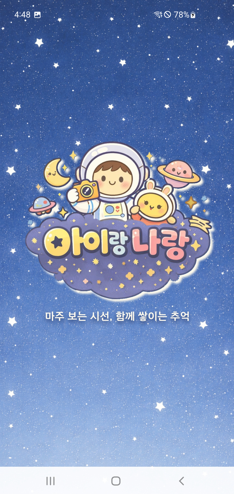
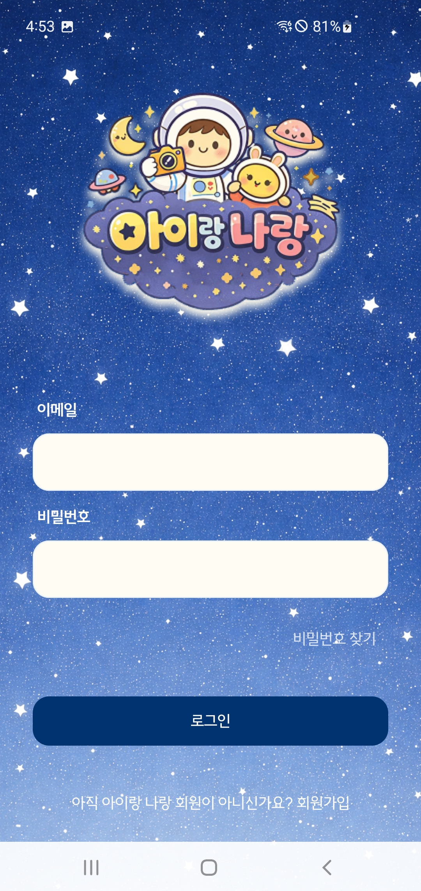
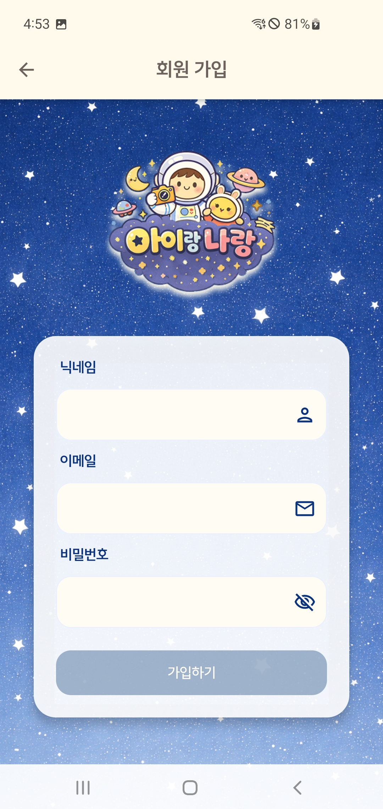

# 👨‍👩‍👧‍👦 아이랑 나랑
### 아이의 순간과, 부모의 시간을 함께 기록하다 


**아이랑 나랑**은 아이의 성장뿐만 아니라 **부모로서 성장해가는 시간과 마음까지** 함께 기록하는 **AI 기반 가족 성장 앨범 서비스**입니다.    

## 📖 프로젝트 소개

**아이랑 나랑**은 단순한 사진 저장 앱이 아닌, 아이와 부모가 함께 만들어가는 **성장 스토리 플랫폼**입니다.

전·후면 동시 촬영을 통해 아이를 바라보는 **부모의 모습까지 한 순간에 기록**하고, AI 분석을 통해 흩어진 기록들을 의미 있는 **이야기와 영상**으로 재구성합니다.

---

## 🤔 기획 배경
아이의 사진은 남아 있지만, 그 순간을 함께한 부모의 표정과 감정은 쉽게 사라집니다.
아이랑 나랑은 이 질문에서 출발했습니다.
> *“아이의 성장만큼,
부모가 되어가는 우리의 시간도 기록할 수 없을까?”*
>

---
## ✨ 핵심 가치

#### 1. 👨‍👩‍👧 함께하는 순간
 전·후면 동시 촬영을 통해 아이와 부모의 모습을 **하나의 프레임**에 담습니다.

#### 2. 🌱 성장 스토리
단순한 사진 나열이 아닌, AI가 분류한 키워드를 기반으로 의미 있는 순간을 자동으로 정리하고 영상으로 만듭니다.

#### 3. 🤝 공유와 연결
아이별로 정리된 성장 기록을 가족과 함께 공유하며 추억과 유대감을 이어갑니다.

---
## 🚀 주요 기능 (Key Features)

### 🏠  메인 화면 (Home)

- 아이랑 나랑의 메인 화면은 AI가 사진 속 순간을 분석해 자동으로 분류한 **의미 있는 ‘모음’들을 행성으로** 구성합니다.

- 사진을 하나씩 정리하지 않아도, AI가 상황과 맥락을 이해해 아이의 성장 순간을 자연스럽게 묶어줍니다.

- 각 행성에 방문해서 아이와의 추억들을 모아 볼 수 있습니다.


### 🤖 AI 키워드 분류 시스템 (AI Collection)

- AI는 사진을 분석해 아래 **5가지 대분류**를 기준으로 일관성을 유지하며 세부 키워드를 자동 생성합니다.

- **물건 / 행동 / 의상 / 장소 / 분위기** 생성된 키워드는 의미에 맞는 **행성 아이콘**과 매칭되어 메인 화면에 시각적으로 표현됩니다.

- 사진이 쌓일수록 행성의 **크기가 커지고** 더 많은 사진이 모일수록 **다양한 행성**이 생성되어 아이의 성장을 **직관적으로 체감**할 수 있습니다.


### 🎬 하이라이트 생성 (Growth Movie)

- 사용자는 **행성** 또는 **날짜(기간)** 를 선택해 원하는 순간들만 모은 **하이라이트 영상(슬라이드 쇼)** 을 생성할 수 있습니다.

- AI가 자동으로 분류한 기록을 바탕으로 흩어져 있던 사진들이 하나의 **성장 이야기 영상**으로 완성됩니다.


### 📸 듀얼 카메라 기록 (Dual Camera)

아이를 바라보는 **부모의 순간까지 함께 기록합니다.**

- 전·후면을 동시 촬영할 수 있습니다. (사진 / 영상)
- 촬영 직후 코멘트를 통해 그 순간의 감정과 상황을 함께 기록할 수 있습니다.


### 📂 스마트 앨범 (Smart Album)
추억을 가장 편하게 찾아볼 수 있는 앨범입니다.
##### **보기 모드**
- **캘린더 뷰**: 날짜별로 촬영한 사진들을 찍은 날짜들을 확인 가능합니다.
- **격자 뷰**: 최신순 탐색 하며 전체 사진을 한눈에 확인 할 수 있습니다.
##### **한 달 앨범**
- 공유 전 사진을 임시로 확인·선별하여 예쁜 추억만을 공유 할 수 있습니다.
- 30일 후 자동 삭제로 저장 공간 관리 할 수 있습니다.
##### 상세 보기
- 확대 및 축소를 이용하여 사진을 자세히 볼 수 있습니다.
- 캡션 수정 및 삭제 지원하여 실수를 수정할 수 있습니다.

### 🔐 회원 및 가족 연결 (User & Family)
가족 구성원을 초대해 소중한 추억을 **함께 기록하고 공유**합니다.

##### **프로필 설정**
- 부모(사용자)와 아이의 프로필을 개별 관리하며, 아이의 생일을 기준으로 디데이를 자동 계산합니다.

##### 가족 초대
- 초대 코드(링크)를 통해 간편하게 가족을 연결할 수 있습니다.

##### 권한 관리
- **관찰자 (Viewer)**: 사진 열람만 가능 합니다.
- **사진사 (Member)**: 사진 촬영, 업로드까지 할 수 있습니다. (부모)
###### 데이터 동기화
- 연결된 모든 가족 구성원 간 앨범 데이터가 실시간으로 동기화됩니다.

<h2 align="center">👥 팀원 구성</h2>

<div align="center">
<table>
  <tr>
    <td align="center" width="300px">
      <a href="https://github.com/kguard">
        <br>
        <br><b>김경호</b><br>
        <sub>(Mobile / Leader)</sub>
      </a>
      <hr>
      <div align="left">
        <sub>
          • 팀장 / 비즈니스 로직 및 아키텍처 구현 <br>
          • 듀얼 카메라 구현 / 로그인 화면 구현 <br>
          • 홈 화면 2차 구현 / 아이 페이지 구현
        </sub>
      </div>
    </td>
    <td align="center" width="300px">
      <a href="https://github.com/ghwns9652">
        <br>
        <br><b>김호준</b><br>
        <sub>(Backend / Infra)</sub>
      </a>
      <hr>
      <div align="left">
        <sub>
          • 회원 그룹 및 아이 정보 관리 구현 <br>
          • 아이 얼굴 인식 및 추억 하이라이트 생성 <br>
          • AWS 서버 관리, CI/CD, DB 설계
        </sub>
      </div>
    </td>
    <td align="center" width="300px">
      <a href="https://github.com/jaehyunkkk">
        <br>
        <br><b>김재현</b><br>
        <sub>(Backend)</sub>
      </a>
      <hr>
      <div align="left">
        <sub>
          • 인증 및 회원 / Media 관리 기능 구현 <br>
          • Media 키워드 추출 및 클러스터링 구현 <br>
          • 알림(FCM Token) 구현, S3 관리
        </sub>
      </div>
    </td>
  </tr>
  <tr>
    <td align="center">
      <a href="https://github.com/KIMSUJIN453">
        <br>
        <br><b>김수진</b><br>
        <sub>(Mobile)</sub>
      </a>
      <hr>
      <div align="left">
        <sub>
          • 기획 <br>
          • 홈 화면 1차 구현 <br>
          • UI/UX 디자인 총괄
        </sub>
      </div>
    </td>
    <td align="center">
      <a href="https://github.com/carvejade">
        <br>
        <br><b>서지원</b><br>
        <sub>(Mobile)</sub>
      </a>
      <hr>
      <div align="left">
        <sub>
          • 기획 <br>
          • 앨범 페이지 1차 구현 <br>
          • UI/UX 디자인 참여
        </sub>
      </div>
    </td>
    <td align="center">
      <a href="https://github.com/814andy">
        <br>
        <br><b>조현서</b><br>
        <sub>(Mobile)</sub>
      </a>
      <hr>
      <div align="left">
        <sub>
          • 마이페이지 화면 구현 <br>
          • 앨범 페이지 2차 구현 <br>
          • UI/UX 디자인 참여
        </sub>
      </div>
    </td>
  </tr>
</table>
</div>

## 🖥️ 실제 페이지 (화면 구성)

<table>
  <tr>
    <td align="center" style="padding:20px;">
      <br/><br/>
      <b>스플래시 화면</b>
    </td>
    <td align="center" style="padding:20px;">
      <br/><br/>
      <b>로그인 화면</b>
    </td>
    <td align="center" style="padding:20px;">
      <br/><br/>
      <b>회원가입 화면</b>
    </td>
    <td align="center" style="padding:20px;">
      <br/><br/>
      <b>메인 홈 화면</b>
    </td>
   </tr>
   <tr>
    <td align="center" style="padding:20px;">
      <br/><br/>
      <b>앨범 화면</b>
    </td>
    <td align="center" style="padding:20px;">
      <br/><br/>
      <b>하이라이트 생성 화면</b>
    </td>
    <td align="center" style="padding:20px;">
      <br/><br/>
      <b>아기 화면</b>
    </td>
    <td align="center" style="padding:20px;">
      <br/><br/>
      <b>마이페이지 화면</b>
    </td>
  </tr>
</table>

---

## 💿 시스템 아키텍처


---


## 🛠️ 기술 스택 
### 📱 앱

| Category  | Stack |
| --- | --- |
| **Language** |  |
| **UI** | -4285F4?style=flat-square&logo=jetpackcompose) |
| **Architecture** | -green?style=flat-square) |
| **Data Strategy** |  |
| **IDE** | -3DDC84?style=flat-square&logo=androidstudio) |
| **Min SDK** | -lightgrey?style=flat-square) |
| **Target SDK** |  |
| **Major Libs** |  |

### ⚙️ 백엔드
고성능과 확장성을 위해 최신 Java 버전과 Spring Boot 생태계를 활용합니다.

| Category | Stack |
| :--- | :--- |
| **Language** |  |
| **Framework** |  |
| **Database** |  |
| **Major Libraries** | `Spring Security`, `Spring Validation`, `Spring Data JPA`, `Spring WebMVC`, `Springdoc OpenAPI 3.0.0`, `AWS SDK for Java S3`, `Firebase Admin SDK`, `JJWT`, `ELKI 0.7.5`, `JAVE2 3.5.0`, `Thumbnailator 0.4.20`, `Apache Commons Lang3`, `Lombok` |
| **Build Tool** |  |
| **IDE** |  |


### 🤖 AI (Artificial Intelligence)

얼굴 인식 및 고성능 연산을 위한 API 서버 구성입니다.

| Category | Stack |
| :--- | :--- |
| **Language** |  |
| **Framework** |   |
| **Computer Vision** |   |
| **Inference** |   |
| **Math** |  |

### 🚀 DevOps & Infrastructure

안정적인 배포와 운영을 위한 인프라 스펙입니다.

| Category | Specification |
| :--- | :--- |
| **Instance** |  (4 vCPUs, 16 GB RAM) |
| **Storage** |  |
| **Container** |   |
| **CI/CD** |  |
| **Web Server** |  |

---
## 🏗️ 패키지 구조

<details>
<summary>📱 Android (App) Package Structure</summary>
<div markdown="1">

```text
📂 App
 ┣ 📂app
 ┃ ┣ 📂src
 ┃ ┃ ┣ 📂main
 ┃ ┃ ┃ ┣ 📂java
 ┃ ┃ ┃ ┃ ┗ 📂com/a602/commonproject
 ┃ ┃ ┃ ┃ ┃ ┣ 📂navigation
 ┃ ┃ ┃ ┃ ┃ ┣ 📂ui
 ┃ ┃ ┃ ┃ ┃ ┣ 📜LMApplication.kt
 ┃ ┃ ┃ ┃ ┃ ┗ 📜MainActivity.kt
 ┃ ┃ ┃ ┣ 📂res
 ┃ ┃ ┃ ┗ 📜AndroidManifest.xml
 ┃ ┗ 📜build.gradle.kts
 ┣ 📂core
 ┃ ┣ 📂common
 ┃ ┣ 📂data
 ┃ ┣ 📂database
 ┃ ┣ 📂datastore
 ┃ ┣ 📂designsystem
 ┃ ┣ 📂model
 ┃ ┣ 📂navigation
 ┃ ┣ 📂network
 ┃ ┣ 📂notifications
 ┃ ┣ 📂ui
 ┃ ┗ 📜build.gradle.kts
 ┣ 📂feature
 ┃ ┣ 📂album (Gallery)
 ┃ ┃ ┣ 📂src/main/java/com/a602/commonproject/feature/album
 ┃ ┃ ┃ ┣ 📂navigation
 ┃ ┃ ┃ ┣ 📂viewmodel
 ┃ ┃ ┃ ┗ 📜...
 ┃ ┣ 📂baby
 ┃ ┃ ┣ 📂src/main/java/com/a602/commonproject/feature/baby
 ┃ ┃ ┃ ┣ 📂navigation
 ┃ ┃ ┃ ┣ 📂viewmodel
 ┃ ┃ ┃ ┗ 📜...
 ┃ ┣ 📂camera
 ┃ ┃ ┣ 📂src/main/java/com/a602/commonproject/feature/camera
 ┃ ┃ ┃ ┣ 📂navigation
 ┃ ┃ ┃ ┗ 📜...
 ┃ ┣ 📂home (Memory)
 ┃ ┃ ┣ 📂src/main/kotlin/com/a602/commonproject/feature/home
 ┃ ┃ ┃ ┣ 📂navigation
 ┃ ┃ ┃ ┣ 📂viewmodel
 ┃ ┃ ┃ ┗ 📜...
 ┃ ┣ 📂login
 ┃ ┃ ┣ 📂src/main/kotlin/com/a602/commonproject/feature/login
 ┃ ┃ ┃ ┣ 📂login
 ┃ ┃ ┃ ┣ 📂navigation
 ┃ ┃ ┃ ┣ 📂signup
 ┃ ┃ ┃ ┣ 📂splash
 ┃ ┃ ┃ ┗ 📜...
 ┃ ┣ 📂mypage
 ┃ ┃ ┣ 📂src/main/java/com/a602/commonproject/feature/mypage
 ┃ ┃ ┃ ┣ 📂navigation
 ┃ ┃ ┃ ┣ 📂viewmodel
 ┃ ┃ ┃ ┗ 📜...
 ┃ ┗ 📜build.gradle.kts
 ┣ 📂gradle
 ┣ 📜build.gradle.kts
 ┣ 📜gradle.properties
 ┣ 📜local.properties
 ┗ 📜settings.gradle.kts
 ```
</div> </details>

<details> 
<summary>🖥️ Backend Package Structure</summary> 
<div markdown="1">

```Plaintext
📂 com.babynme.app
┣ 📂api
┃ ┣ 📂ai
┃ ┣ 📂auth
┃ ┣ 📂baby
┃ ┣ 📂batch
┃ ┣ 📂collections
┃ ┃ ┣ 📂dto
┃ ┃ ┣ 📂event
┃ ┃ ┣ 📂job
┃ ┃ ┣ 📂service
┃ ┃ ┗ 📄CollectionController
┃ ┣ 📂device
┃ ┣ 📂group
┃ ┣ 📂media
┃ ┣ 📂slideshow
┃ ┗ 📂user
┣ 📂config
┃ ┣ 📂json
┃ ┣ 📂s3
┃ ┣ 📂security
┃ ┃ ┣ 📄CustomUserDetailsService
┃ ┃ ┣ 📄CustomUserPrincipal
┃ ┃ ┣ 📄JwtAuthenticationFilter
┃ ┃ ┣ 📄JwtTokenProvider
┃ ┃ ┗ 📄SecurityConfig
┃ ┗ 📄AsyncSchedulingConfig
┣ 📂domain
┃ ┣ 📂baby
┃ ┃ ┣ 📂entity
┃ ┃ ┗ 📂repository
┃ ┣ 📂category
┃ ┣ 📂cluster
┃ ┣ 📂device
┃ ┣ 📂embedding
┃ ┣ 📂group
┃ ┣ 📂idempotency
┃ ┣ 📂keyword
┃ ┣ 📂media
┃ ┣ 📂slideshow
┃ ┣ 📂token
┃ ┗ 📂user
┣ 📂exception
┃ ┣ 📂domain
┃ ┣ 📂dto
┃ ┣ 📄CommonErrorCode
┃ ┣ 📄CustomException
┃ ┣ 📄ErrorCode
┃ ┗ 📄GlobalExceptionHandler
┗ 📂infra
  ┣ 📂ai
  ┣ 📂data
  ┣ 📂notification
  ┗ 📂storage 
```
</div> </details>

---
## 📊 DB 구조
### App DB


### Main_DB


## 📽️ 영상 포트폴리오

<video src="./readme_asset/14기_공통PJT_영상_포트폴리오_A602.mp4" width="600" controls></video>

## 📄 문서

[기능 명세](https://www.notion.so/2ea2e9f669ae80149aeac07f171d9cd8?pvs=21)

[API 명세](https://www.notion.so/API-2e92e9f669ae8085b9b7d01566871d2a?pvs=21)

[아이랑_나랑_.pdf](/uploads/0138a3d79e0b8a1e156042828bfeb23a/아이랑_나랑_.pdf)


